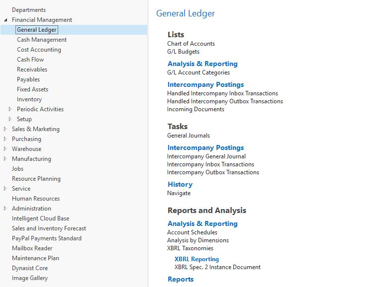

# Departments Menu for Business Central

*Note: This app is intended mainly for internal training purposes, covering many aspects and technics of AL development.*

Departments menu was a feature of Windows Client (RTC) that is unavailable on the Web Client, now Modern Client. This app's aim is to replicate a similar functionality using AL and JavaScript components.

**Find more details in a related [LinkedIn article](in_progress).**

## Features

* **Import MenuSuite Objects:** import MenuSuite object txt files into the database
* **Manual Menu Structure:** create/update menu entries
* **Department View:** display treeview menu hierarchy and load pages/reports upon selection

## Screenshots

### Department View: Seach (ALT+Q) -> Departments

### Department Suites

### Department Menu Items

## Installation

Download and build the project by yourself or use company-signed, cloud-compatible packages in [SignedPackages](https://github.com/dynasist/bc-departments/tree/master/SignedPackages) folder.